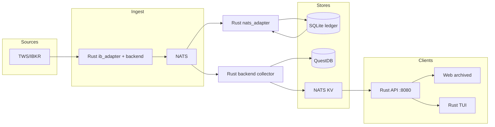

# Dataflow Architecture

**Last updated**: 2026-03-14 (Rust-first datapath; broker/data provider tables)
**Purpose**: Comprehensive analysis of data flow, storage, and inter-component contracts.
Used as the ground-truth reference for AI-assisted development.

---

## 1. End-to-End Data Flow

### Market data (TWS → storage → clients)

```
IBKR TWS (port 7497)
  └─► Rust ib_adapter (agents/backend/crates/ib_adapter)
        └─► backend_service
              ├─► NATS: market-data.tick.<symbol>, strategy.*  [NatsEnvelope protobuf]
              │     ├─► Rust backend collector → QuestDB (ILP), NATS KV LIVE_STATE
              │     └─► Rust nats_adapter → in-memory state, ledger
              └─► REST / WebSocket snapshot API (:8080)
```

### Client data read paths

```
Rust TUI (tui_service)
  ├─► REST: GET /api/v1/snapshot, /api/v1/frontend/*
  ├─► Optional: NATS provider (event-driven live state)
  └─► Bank/loans: GET /api/v1/loans, bank-accounts (Rust-owned)

Web (archived; read path valid if revived)
  └─► SnapshotClient
        ├─► WebSocket: ws://localhost:8080/ws/snapshot (full on connect, then delta every ~2s)
        └─► REST fallback: GET /api/v1/snapshot every 2s
  Other: /api/v1/frontend/*, /api/bank-accounts, /api/balance, /api/transactions
```

### Order execution flow

```
User action (TUI / CLI)
  └─► Rust backend API
        └─► ib_adapter → TWS API → IBKR exchange
              └─► Callbacks → backend state, NATS strategy.decision.*
                    └─► Rust nats_adapter / ledger → SQLite
```

### Ledger / Persistence Write Paths

```
Rust ledger crate (sqlx + SQLite)
  └─► writes to: agents/backend/data/ledger.db

Rust backend loan store
  └─► owns active loan CRUD and the transitional backend loan JSON store
        └─► legacy seed/import only: config/loans.json

(No Python integration tier; Rust is the only active backend/TUI/CLI.)

QuestDB
  └─► written by: Rust backend collector QuestDB sink (ILP protocol)
  └─► read by: Python analytics / notebooks
```

---

## 2. Storage Layer Inventory

| Store | Technology | Written By | Read By | Data | TTL / Retention |
|-------|-----------|-----------|---------|------|-----------------|
| NATS KV | NATS JetStream | Rust backend collector | Rust API, TUI NatsProvider, Web (if revived) | Live state (key = messageType.symbol, value = full `NatsEnvelope` protobuf) | Configurable |
| SQLite (ledger) | Rust (sqlx) | Rust ledger crate | Rust API, positions | Ledger, positions | Permanent |
| Loan store | Rust backend (transitional JSON-backed) | Rust backend | Rust API, TUI via `/api/v1/loans` | Loan records / loan-derived views | Permanent |
| QuestDB | Rust (ILP) | backend collector | Analytics / notebooks | Tick time-series | Configurable |

### 2.1 Datapath summary

| Path | Source | Sink | Technology |
|------|--------|------|------------|
| Market data ingest | IBKR TWS (7497) | NATS, LIVE_STATE KV, QuestDB | Rust ib_adapter → backend_service |
| Order execution | TUI/CLI → REST | IBKR exchange | Rust backend → ib_adapter → TWS API |
| Snapshot read | Rust API :8080 | TUI, Web (archived) | REST / WebSocket |
| Ledger write | Orders, positions, decisions | SQLite ledger | Rust ledger crate |
| Loan CRUD | REST `/api/v1/loans` | Loan store (transitional JSON) | Rust backend |

### 2.2 Feature readiness

| Feature | Status | Owner | Notes |
|---------|--------|--------|-------|
| IBKR order execution | Production | Rust ib_adapter | TWS API; paper (7497) and live |
| IBKR market data / positions | Production | Rust ib_adapter | Tick data, account summary |
| Snapshot API (unified positions) | Production | Rust backend | REST + WebSocket delta |
| Ledger (SQLite) | Production | Rust ledger | Single writer |
| Loan API | Production | Rust backend | Transitional store; final durability pending |
| NATS LIVE_STATE / QuestDB | Production | Rust backend collector | When NATS and collector configured |
| TUI (Rust) | Production | Rust tui_service | Primary frontend |
| Web frontend | Archived | — | Read path valid if revived |
| Alpaca / Tastytrade | Retired | — | Not in active runtime |
| Israeli bank scrapers | Optional / file-based | Config | Manual file import preferred; scrapers service optional |
| Discount Bank reconciliation | Production | Rust bank routes / file import | Ledger + REST |

### 2.3 Broker support

| Broker / institution | Role | Status | Implementation |
|----------------------|------|--------|-----------------|
| **IBKR** (Interactive Brokers) | Trading, market data, positions | Active | Rust `ib_adapter` (TWS API, port 7497 paper / live) |
| **Alpaca** | Trading, positions | Retired | Not in active runtime; config flag disabled by default |
| **Tastytrade** | Trading, positions | Retired | Not in active runtime |
| **Discount Bank** | Banking, cash, loans, securities | Active | Rust bank-account routes; file-based reconciliation import |
| **Fibi** | Israeli bank | Config / file-based | broker.priorities; scrapers or file import |
| **Meitav / IBI** | Israeli brokers | Config / file-based | broker.priorities; cache, margin, TASE + US |
| **Pension funds** | Aggregation | Account-level | Same pattern as other providers |

### 2.4 Data provider (market data and positions)

| Provider | Data type | Status | Notes |
|-----------|-----------|--------|-------|
| **IBKR TWS** | Ticks, quotes, account summary, positions, orders | Active | Primary live source via Rust ib_adapter |
| **Rust backend** | Snapshot, LIVE_STATE KV, health | Active | Aggregates and serves to TUI/Web |
| **NATS** | NatsEnvelope (market-data.*, strategy.*) | Active | When NATS server and collector running |
| **Discount Bank** | Balances, loans, transactions | Active | REST + reconciliation file import |
| **Mock / file** | Synthetic or file-based positions | Active | Testing and development |
| **Alpaca / Tastytrade** | Market data, positions | Retired | Not in active runtime |

---

**NATS KV key schema (bucket LIVE_STATE):** Keys are `messageType.symbol` (e.g. `MarketDataEvent.SPY`, `StrategyDecision.AAPL`). Values are full serialized `NatsEnvelope` records, not just inner payload bytes. Written by the Rust backend collector when it receives NATS messages. Read from the Rust backend via `GET /api/live/state` (list keys), `GET /api/live/state?key=MarketDataEvent.SPY` (one key, raw value base64 plus decoded envelope metadata), or `GET /api/live/state/watch` (SSE stream of KV updates with the same metadata). **Requires NATS server 2.6.2+** (JetStream Key-Value).

---

## 3. NATS Message Contract

All C++ published messages use `NatsEnvelope` (protobuf binary):

```protobuf
message NatsEnvelope {
  string id = 1;
  google.protobuf.Timestamp timestamp = 2;
  string source = 3;
  string message_type = 4;
  bytes payload = 5;       // serialized inner message
}
```

| Topic | Inner Message | Publisher | Subscribers |
|-------|--------------|-----------|-------------|
| `market-data.tick.<symbol>` | `MarketDataEvent` | Rust backend (ib_adapter / collector) | Rust backend collector, Rust nats_adapter |
| `strategy.signal.<symbol>` | `StrategySignal` | Rust backend | Rust nats_adapter |
| `strategy.decision.<symbol>` | `StrategyDecision` | Rust backend | Rust nats_adapter |
| `system.health` | protobuf (`BackendHealth` or `NatsEnvelope`) | Rust backend, optional Go/other | Rust health aggregation and Rust-facing health routes |

**Note**: `NatsEnvelope` protobuf is now the only supported active wire format in the
Rust adapter and Rust backend collector. The active collector
understands envelope records directly; older doc references to JSON transport, the removed
standalone QuestDB bridge, or raw-string parsing are stale.

**Publish rule**: publishers must use concrete symbol-scoped subjects. Wildcards like
`strategy.signal.>` and `strategy.decision.>` are subscriber-only. See
See [CURRENT_TOPOLOGY.md](CURRENT_TOPOLOGY.md) for current data paths (CPP_RUST_DATAPATH_CONTRACT.md removed).

---

## 4. Serialization / Schema

Canonical schema: `proto/messages.proto`. Codegen via `./proto/generate.sh`.

| Language | Output path | Format | Status |
|----------|------------|--------|--------|
| Rust | `agents/backend/crates/nats_adapter/` (prost) | protobuf binary | Active |
| Go | `agents/go/proto/v1/messages.pb.go` | protobuf binary | Active |
| Python | `proto/generate.sh` → Python output | protobuf / JSON | Optional helper; no active runtime tier |
| TypeScript | `web/src/proto/messages.ts` (ts-proto) | JSON / binary | Generated; web archived |

Schema management: `proto/generate.sh` (shell script).
**Recommended upgrade**: migrate to `buf` — single `buf generate` command, lint, and breaking-change detection in CI.

---

## 5. Go Agents Inventory

All in `agents/go/cmd/`. Pure stdlib + `nats.go`. Structured logging via `log/slog`.

| Agent | Purpose | Listens | Exposes |
|-------|---------|---------|---------|
| `backend collector` | Unified NATS collector (Epic E5): decode `NatsEnvelope` once, write through sinks (KV/log/QuestDB today) | NATS `market-data.>`, etc. | Rust backend health/metrics surface |
| `supervisor` | Process supervisor (restart on crash) | JSON config | Process PIDs |
| `config-validator` | Validates platform config at startup | Config file | Exit code |

---

## 6. Financial Math: Current State

| Capability | Location | Status | Gap |
|------------|---------|--------|-----|
| Options Greeks (delta/gamma/theta/vega) | Rust `crates/quant` | Active | No IV solver — takes IV as external input |
| Box spread implied rate | Rust quant/strategy | Active | Formula: `((K2-K1 - debit)/debit) × (365/dte) × 100` |
| ETF duration/convexity | Rust quant | Lookup or calc | Improve with bond-function duration where needed |
| Bond convexity optimization | Rust `crates/quant` (convexity) | Active | Barbell-style optimization |
| Yield curve construction | Rust quant (yield_curve) | Simple interpolation | Nelson-Siegel / Svensson fitting future |
| Amortization schedules | Rust quant (amortization) | SHIR + CPI-linked (Israeli) | Standard PMT / schedule future |
| Loan management | Rust backend loan API/store | Active owner for CRUD / aggregation | Final durable backing store still pending |
| Put-call parity check | Rust quant/strategy | Active | — |
| VaR / risk limits | Rust `crates/risk` | Active | Parametric; historical/Monte Carlo future |

---

<!-- task-discovery: issue numbers below map to exarp task IDs for direct lookup -->

## 7. Known Issues (Technical Debt)

### Critical

| # | Issue | Location | Impact | Exarp Task |
|---|-------|---------|--------|------------|
| 1 | **Legacy docs still describe Python ledger overlap**: active ownership is Rust, but some architecture notes still mention older Python read paths | `agents/backend/crates/ledger`, docs | Documentation drift can obscure current ownership boundaries | T-1772887221775761020 |
| 2 | **Legacy docs still describe split TUI backends**: the active TUI path is Rust-first, but some notes still mention older Python specialist reads | docs, retired Python references | Documentation drift can obscure current runtime topology | T-1772887221914991889 |

### High

| # | Issue | Location | Impact | Exarp Task |
|---|-------|---------|--------|------------|
| 3 | ~~**WebSocket full snapshot**: Rust WS sends complete `SystemSnapshot` every 2s regardless of changes~~ **DONE (P2-A)**: full snapshot on connect, then delta every 2s | `agents/backend/src/ws.rs` | — resolved | T-1772887222103963807 ✅ |
| 4 | ~~**Go agents not decoding NatsEnvelope**: raw byte parsing instead of protobuf in the old bridge / heartbeat path~~ **DONE**: active Go collectors decode envelopes | `agents/go/cmd/*` | — resolved | T-1772887221969976131 ✅ |
| 5 | **Hardcoded ETF duration table**: static lookup | Rust `crates/quant` | Wrong values for newly listed ETFs; maintenance burden | T-1772887222158664215 |
| 6 | **No IV solver**: IV must come from market data | Rust `crates/quant` | Cannot calculate IV from price; blocks model-based workflows | T-1772887222213114929 |

### Medium

| # | Issue | Location | Impact | Exarp Task |
|---|-------|---------|--------|------------|
| 7 | **No Nelson-Siegel curve fit**: only simple interpolation | legacy Python research path / future implementation target | Yield curve quality limited; parametric fitting standard in fixed income | T-1772887222348905245 |
| 8 | **No standard amortization**: only Israeli loan types | legacy Python research path / future implementation target | Cannot produce standard PMT schedule or XIRR | T-1772887222449509427 |
| 9 | **proto/generate.sh**: shell script, no lint/breaking detection | `proto/generate.sh` | Schema drift undetected until runtime; multi-step setup | T-1772887222270264987 |
| 10 | ~~**No structured logging in Go agents**: `log.Printf` only~~ **DONE**: all agents use `slog` | `agents/go/cmd/*/main.go` | — resolved | T-1772887222034956306 ✅ |
| 11 | **Loan persistence still transitional**: Rust owns active loan CRUD, but the backend store is still JSON-backed before the final durable-store move | `agents/backend/crates/api/src/loans.rs` | Ownership is fixed, but final durability story is not complete | T-1773188906786378000 |

---

## 8. TUI Provider Architecture

```
Provider (abstract)
├── MockProvider          — synthetic data, no external deps
├── RestProvider          — polls the configured REST origin (Rust API or selected Python integration service)
├── FileProvider          — reads JSON files, polls on mtime
└── NatsProvider          — event-driven, subscribes to NATS subjects

BackendHealthAggregator   — daemon thread, polls configured backend health endpoints
```

Provider selection historically came from the retired Python/Textual TUI provider flag/config. The active Rust TUI now prefers protobuf-over-NATS and uses REST only as an explicit fallback path.

---

## 9. Web Frontend Architecture

```
SnapshotClient (web/src/api/snapshot.ts)
├── Primary: WebSocket ws://localhost:8080/ws/snapshot
│     - Full SystemSnapshot on connect; then only changed sections (delta) every ~2s
│     - Reconnect with exponential backoff (max 10 attempts)
└── Fallback: REST GET /api/v1/snapshot every 2s

useBackendServices hook (web/src/hooks/useBackendServices.ts)
└── 8 concurrent health checks every 10s
      Fast path: shared Rust health path; heartbeat-specific operational reads also come through Rust-owned routes
```

---

## 10. Dataflow and Persistence Improvements

### Single writer per store (target state)

One writer per store; all readers use that store or a gateway. Eliminates dual-write corruption and clarifies ownership.
Python remains outside collection and shared read-model ownership in this target state; it consumes specialist or analytics paths only.

| Store | Single writer | Readers |
|-------|----------------|---------|
| SQLite (ledger) | Rust ledger crate only | Rust API |
| QuestDB | Rust backend collector only | Analytics, notebooks |
| NATS KV (live state) | Rust backend collector | Rust API, TUI NatsProvider, Web (if revived) |
| Loan store | Rust backend only | Rust API, TUI via `/api/v1/loans` |

### Persistence rule

**Write once, then publish.** For orders and critical state: persist to durable storage (or append to a JetStream stream) first; only then publish to NATS or update in-memory state and serve to clients. Ensures UI never shows uncommitted state.

### Target dataflow (deduplicated)



- **Current read paths**: Rust TUI and archived Web (if revived) read from Rust backend (REST/WebSocket); optional NATS provider for live state.
- **Single writer per store**: Ledger = Rust; loans = Rust backend; QuestDB = Rust backend collector; NATS KV = Rust backend collector.
- **Persistence**: Rust writes durable backend state, serves shared read models, and writes QuestDB/live state from NATS.

### Implementation order (task dependencies)

| Step | Task | Depends on |
|------|------|------------|
| 1 | P1-A: Fix dual SQLite writers | — |
| 2 | P1-B: Unify TUI/Web via shared Rust origin | — (can parallel with P1-A) |
| 3 | P2-B: Decode NatsEnvelope in Go agents | — |
| 4 | P2-C: NATS KV as primary live-state store | P2-B |
| 5 | Document single-writer and persistence rule | — (done in this section) |

See `docs/platform/IMPROVEMENT_PLAN.md` for full task IDs (P1-A: T-1772887221775761020, P1-B: T-1772887221914991889, P2-B: T-1772887221969976131, P2-C: T-1772925042919416172).

---

## Related Documentation

- `ARCHITECTURE.md` — high-level overview (keep in sync)
- `docs/platform/IMPROVEMENT_PLAN.md` — prioritized improvement roadmap
- `docs/message_schemas/README.md` — proto schema and migration status
- `docs/platform/SYNTHETIC_FINANCING_ARCHITECTURE.md` — multi-asset relationship design
- `docs/research/architecture/CODEBASE_ARCHITECTURE.md` — legacy component detail
