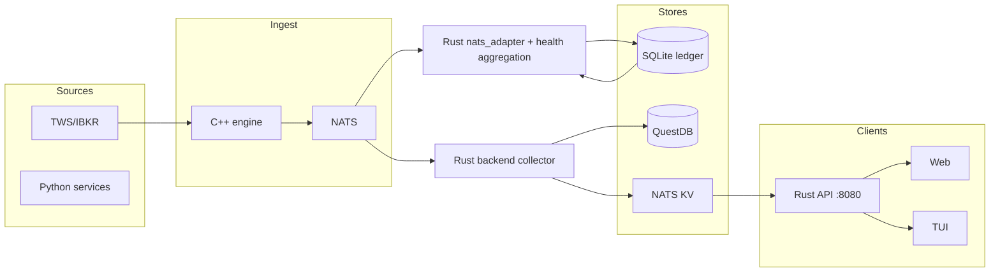

# Dataflow Architecture

**Last updated**: 2026-03-11 (runtime ownership and datapath alignment)
**Purpose**: Comprehensive analysis of data flow, storage, and inter-component contracts.
Used as the ground-truth reference for AI-assisted development.

---

## 1. End-to-End Data Flow

### Market Data (TWS → Storage → Clients)

```
IBKR TWS (port 7497)
  └─► C++ tws_client.cpp
        ├─► InMemoryCache (hot tick data, C++ only)
        ├─► nats_client.cpp
        │     └─► NATS: market-data.tick.<symbol>  [NatsEnvelope protobuf]
        │           ├─► Rust backend collector
        │           │     ├─► QuestDB via ILP (time-series archive)
        │           │     └─► NATS KV LIVE_STATE
        │           └─► Rust nats_adapter
        │                 └─► Rust backend (in-memory state)
        └─► Python integration layer
              └─► Local in-process caches only
```

### Client Data Read Paths

```
TUI (Python/Textual)
  ├─► Rust frontend API: shared read models (snapshot, unified positions,
  │                      relationships, cash flow, opportunity simulation)
  ├─► Python integration services: broker snapshots, discount-bank accounts,
  │                                internal finance helpers where Rust still proxies to Python
  └─► NATS provider: event-driven fallback / live updates

Web (React)
  └─► SnapshotClient
        ├─► WebSocket: ws://localhost:8080/ws/snapshot
        │     └─► Rust backend: full SystemSnapshot on connect, then only changed sections (delta) every 2s
        └─► REST fallback: GET /api/v1/snapshot every 2s

  Other web read models:
    ├─► Rust frontend endpoints (`/api/v1/frontend/*`)
    ├─► Rust `/api/bank-accounts`, `/api/balance`, `/api/transactions`
    └─► Rust-owned benchmark / curve endpoints

```

### Order Execution Flow

```
User action (TUI / Web / CLI)
  └─► C++ order_manager.cpp
        └─► tws_client.cpp → TWS API → IBKR exchange
              └─► Callbacks: onOrderStatus / onExecution / onPosition
                    └─► order_manager: update state, notify NATS
                          └─► NATS: strategy.decision.<symbol>
                                └─► Rust nats_adapter → SQLite ledger
```

### Ledger / Persistence Write Paths

```
Rust ledger crate (sqlx + SQLite)
  └─► writes to: agents/backend/data/ledger.db

Rust backend loan store
  └─► owns active loan CRUD and the transitional backend loan JSON store
        └─► legacy seed/import only: config/loans.json

Python integration / TUI
  └─► reads snapshot, ledger-adjacent, and loan data
        └─► no active durable write ownership

QuestDB
  └─► written by: Rust backend collector QuestDB sink (ILP protocol)
  └─► read by: Python analytics / notebooks
```

---

## 2. Storage Layer Inventory

| Store | Technology | Written By | Read By | Data | TTL / Retention |
|-------|-----------|-----------|---------|------|-----------------|
| InMemoryCache | C++ (custom) | tws_client | C++ engine only | Hot tick prices | In-process |
| NATS KV | NATS JetStream | Rust backend collector | Rust API, TUI NatsProvider, Web (future) | Live state (key = messageType.symbol, value = full `NatsEnvelope` protobuf) | Configurable |
| SQLite (ledger) | Rust (sqlx) | Rust + selected Python read paths | Ledger, positions | Permanent |
| Loan store | Rust backend (transitional JSON-backed) | Rust backend | Rust API, Python TUI via `/api/v1/loans` | Loan records / loan-derived views | Permanent |
| QuestDB | Rust (ILP) | backend collector | Python analytics | Tick time-series | Configurable |

**NATS KV key schema (bucket LIVE_STATE):** Keys are `messageType.symbol` (e.g. `MarketDataEvent.SPY`, `StrategyDecision.AAPL`). Values are full serialized `NatsEnvelope` records, not just inner payload bytes. Written by the Rust backend collector when it receives NATS messages. Read from the Rust backend via `GET /api/live/state` (list keys), `GET /api/live/state?key=MarketDataEvent.SPY` (one key, raw value base64 plus decoded envelope metadata), or `GET /api/live/state/watch` (SSE stream of KV updates with the same metadata). **Requires NATS server 2.6.2+** (JetStream Key-Value).

---

## 3. NATS Message Contract

All C++ published messages use `NatsEnvelope` (protobuf binary):

```protobuf
message NatsEnvelope {
  string id = 1;
  google.protobuf.Timestamp timestamp = 2;
  string source = 3;
  string message_type = 4;
  bytes payload = 5;       // serialized inner message
}
```

| Topic | Inner Message | Publisher | Subscribers |
|-------|--------------|-----------|-------------|
| `market-data.tick.<symbol>` | `MarketDataEvent` | C++ nats_client | Rust backend collector, Rust nats_adapter |
| `strategy.signal.<symbol>` | `StrategySignal` | C++ nats_client | Rust nats_adapter |
| `strategy.decision.<symbol>` | `StrategyDecision` | C++ nats_client | Rust nats_adapter |
| `system.health` | protobuf (`BackendHealth` or `NatsEnvelope`) | Python services and other backends | Rust health aggregation and Rust-facing health routes |

**Note**: `NatsEnvelope` protobuf is now the only supported active wire format in the
Rust adapter and Rust backend collector. The active collector
understands envelope records directly; older doc references to JSON transport, the removed
standalone QuestDB bridge, or raw-string parsing are stale.

---

## 4. Serialization / Schema

Canonical schema: `proto/messages.proto`. Codegen via `./proto/generate.sh`.

| Language | Output path | Format | Status |
|----------|------------|--------|--------|
| C++ | `native/generated/messages.pb.{h,cc}` | protobuf binary | Active |
| Rust | `agents/backend/crates/nats_adapter/` (prost) | protobuf binary | Active |
| Go | `agents/go/proto/v1/messages.pb.go` | protobuf binary | Active |
| Python | `python/generated/` (betterproto) | protobuf binary / JSON | Generated; used by selected NATS/health consumers |
| TypeScript | `web/src/proto/messages.ts` (ts-proto) | JSON / binary | Generated; API migration pending |

Schema management: `proto/generate.sh` (shell script).
**Recommended upgrade**: migrate to `buf` — single `buf generate` command, lint, and breaking-change detection in CI.

---

## 5. Go Agents Inventory

All in `agents/go/cmd/`. Pure stdlib + `nats.go`. Structured logging via `log/slog`.

| Agent | Purpose | Listens | Exposes |
|-------|---------|---------|---------|
| `backend collector` | Unified NATS collector (Epic E5): decode `NatsEnvelope` once, write through sinks (KV/log/QuestDB today) | NATS `market-data.>`, etc. | Rust backend health/metrics surface |
| `supervisor` | Process supervisor (restart on crash) | JSON config | Process PIDs |
| `config-validator` | Validates platform config at startup | Config file | Exit code |

---

## 6. Financial Math: Current State

| Capability | Location | Status | Gap |
|------------|---------|--------|-----|
| Options Greeks (delta/gamma/theta/vega) | `greeks_calculator.cpp` | Active via QuantLib `BlackCalculator` | No IV solver — takes IV as external input |
| Box spread implied rate | `box_spread_strategy.h` | Active | Formula: `((K2-K1 - debit)/debit) × (365/dte) × 100` |
| ETF duration/convexity | `greeks_calculator.cpp` | Hardcoded lookup table | Should use `QuantLib::BondFunctions::duration()` |
| Bond convexity optimization | `convexity_calculator.cpp` | Active (barbell NLopt) | Relies on hardcoded ETF values |
| Yield curve construction | `yield_curve_comparison.py` | Simple linear interpolation | No Nelson-Siegel / Svensson fitting |
| Amortization schedules | `cash_flow_calculator.py` | SHIR + CPI-linked (Israeli) | No standard PMT / schedule generation |
| Loan management | Rust backend loan API/store | Active owner for CRUD / aggregation | Final durable backing store still pending |
| Put-call parity check | `box_spread_strategy.h` | Active | — |
| VaR / risk limits | `risk_calculator.cpp` | Active | Parametric only; no historical/Monte Carlo |

---

<!-- task-discovery: issue numbers below map to exarp task IDs for direct lookup -->

## 7. Known Issues (Technical Debt)

### Critical

| # | Issue | Location | Impact | Exarp Task |
|---|-------|---------|--------|------------|
| 1 | **Ledger read-path overlap**: Rust owns writes, but some Python services still read SQLite directly instead of going through Rust-owned APIs | `agents/backend/crates/ledger`, `python/integration/` | Ownership is clearer than before, but read-path drift and schema coupling remain | T-1772887221775761020 |
| 2 | **Split data backends**: TUI still mixes selected Python specialist calls with Rust-owned shared reads | `python/tui/providers/`, `python/integration/` | Some TUI workflows can still diverge from shared Rust views | T-1772887221914991889 |

### High

| # | Issue | Location | Impact | Exarp Task |
|---|-------|---------|--------|------------|
| 3 | ~~**WebSocket full snapshot**: Rust WS sends complete `SystemSnapshot` every 2s regardless of changes~~ **DONE (P2-A)**: full snapshot on connect, then delta every 2s | `agents/backend/src/ws.rs` | — resolved | T-1772887222103963807 ✅ |
| 4 | ~~**Go agents not decoding NatsEnvelope**: raw byte parsing instead of protobuf in the old bridge / heartbeat path~~ **DONE**: active Go collectors decode envelopes | `agents/go/cmd/*` | — resolved | T-1772887221969976131 ✅ |
| 5 | **Hardcoded ETF duration table**: static lookup in greeks_calculator | `native/src/greeks_calculator.cpp` | Wrong values for newly listed ETFs; maintenance burden | T-1772887222158664215 |
| 6 | **No IV solver**: BlackCalculator used correctly, but IV must come from market data | `native/src/greeks_calculator.cpp` | Cannot calculate IV from price; blocks model-based workflows | T-1772887222213114929 |

### Medium

| # | Issue | Location | Impact | Exarp Task |
|---|-------|---------|--------|------------|
| 7 | **No Nelson-Siegel curve fit**: only simple interpolation | `python/integration/yield_curve_comparison.py` | Yield curve quality limited; parametric fitting standard in fixed income | T-1772887222348905245 |
| 8 | **No standard amortization**: only Israeli loan types | `python/integration/cash_flow_calculator.py` | Cannot produce standard PMT schedule or XIRR | T-1772887222449509427 |
| 9 | **proto/generate.sh**: shell script, no lint/breaking detection | `proto/generate.sh` | Schema drift undetected until runtime; multi-step setup | T-1772887222270264987 |
| 10 | ~~**No structured logging in Go agents**: `log.Printf` only~~ **DONE**: all agents use `slog` | `agents/go/cmd/*/main.go` | — resolved | T-1772887222034956306 ✅ |
| 11 | **Loan persistence still transitional**: Rust owns active loan CRUD, but the backend store is still JSON-backed before the final durable-store move | `agents/backend/crates/api/src/loans.rs` | Ownership is fixed, but final durability story is not complete | T-1773188906786378000 |

---

## 8. TUI Provider Architecture

```
Provider (abstract)
├── MockProvider          — synthetic data, no external deps
├── RestProvider          — polls the configured REST origin (Rust API or selected Python integration service)
├── FileProvider          — reads JSON files, polls on mtime
└── NatsProvider          — event-driven, subscribes to NATS subjects

BackendHealthAggregator   — daemon thread, polls configured backend health endpoints
```

Provider selection: set via `--provider` CLI flag or config; `RestProvider` is the default in production for the Textual TUI.

---

## 9. Web Frontend Architecture

```
SnapshotClient (web/src/api/snapshot.ts)
├── Primary: WebSocket ws://localhost:8080/ws/snapshot
│     - Full SystemSnapshot on connect; then only changed sections (delta) every ~2s
│     - Reconnect with exponential backoff (max 10 attempts)
└── Fallback: REST GET /api/v1/snapshot every 2s

useBackendServices hook (web/src/hooks/useBackendServices.ts)
└── 8 concurrent health checks every 10s
      Fast path: shared Rust health path; heartbeat-specific operational reads also come through Rust-owned routes
```

---

## 10. Dataflow and Persistence Improvements

### Single writer per store (target state)

One writer per store; all readers use that store or a gateway. Eliminates dual-write corruption and clarifies ownership.
Python remains outside collection and shared read-model ownership in this target state; it consumes specialist or analytics paths only.

| Store | Single writer | Readers |
|-------|----------------|---------|
| SQLite (ledger) | Rust ledger crate only | Rust API; Python should migrate to Rust-owned reads |
| QuestDB | Rust backend collector only | Python analytics, notebooks |
| NATS KV (live state) | Rust backend collector | Rust API, TUI NatsProvider, archived Web (future if revived) |
| Loan store | Rust backend only | Rust API, Python TUI via `/api/v1/loans` |
| InMemoryCache | C++ tws_client | C++ engine only |

### Persistence rule

**Write once, then publish.** For orders and critical state: persist to durable storage (or append to a JetStream stream) first; only then publish to NATS or update in-memory state and serve to clients. Ensures UI never shows uncommitted state.

### Target dataflow (deduplicated)



- **Current read paths**: the web client reads primarily from the Rust backend; the Textual TUI reads a mix of Rust-owned read models, selected Python specialist services, and optional NATS/event-driven paths. The remaining split is now narrower and mostly tied to integration-specific Python services.
- **Single writer per store**: Ledger = Rust; loans = Rust backend; QuestDB = Rust backend collector; NATS KV = Rust backend collector.
- **Persistence**: Rust writes durable backend state, serves shared read models, and writes QuestDB/live state from NATS; Python does not own collection or shared durable writes.

### Implementation order (task dependencies)

| Step | Task | Depends on |
|------|------|------------|
| 1 | P1-A: Fix dual SQLite writers | — |
| 2 | P1-B: Unify TUI/Web via shared Rust origin | — (can parallel with P1-A) |
| 3 | P2-B: Decode NatsEnvelope in Go agents | — |
| 4 | P2-C: NATS KV as primary live-state store | P2-B |
| 5 | Document single-writer and persistence rule | — (done in this section) |

See `docs/platform/IMPROVEMENT_PLAN.md` for full task IDs (P1-A: T-1772887221775761020, P1-B: T-1772887221914991889, P2-B: T-1772887221969976131, P2-C: T-1772925042919416172).

---

## Related Documentation

- `ARCHITECTURE.md` — high-level overview (keep in sync)
- `docs/platform/IMPROVEMENT_PLAN.md` — prioritized improvement roadmap
- `docs/message_schemas/README.md` — proto schema and migration status
- `docs/platform/SYNTHETIC_FINANCING_ARCHITECTURE.md` — multi-asset relationship design
- `docs/research/architecture/CODEBASE_ARCHITECTURE.md` — legacy component detail
