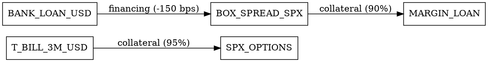

# Multi-Asset Relationship DSL Design

**Date**: 2025-11-19
**Purpose**: Design declarative language for expressing multi-asset financing relationships
**Status**: Design Phase

---

## Overview

This document designs a Domain-Specific Language (DSL) for expressing complex relationships between financial assets in the synthetic financing system. The DSL enables declarative specification of:

- Collateral relationships (assets used as margin)
- Financing relationships (sources of funding)
- Cross-currency relationships (FX and hedging)
- Regulatory relationships (margin offsets, haircuts)
- Optimization constraints

---

## Design Goals

1. **Declarative Syntax:** Express relationships without imperative code
2. **Type Safety:** Domain-specific types for relationships
3. **Validation:** Compile-time validation of relationship constraints
4. **Code Generation:** Generate C++ `AssetRelationship` structs
5. **Visualization:** Generate relationship graphs

---

## Relationship Types

### 1. Collateral Relationships

**Syntax:**
```python
collateral(
    source="T-BILL-3M-USD",
    target="SPX-OPTIONS",
    ratio=0.95,  # 95% collateral value (haircut applied)
    brokers=["IBKR", "ALPACA"],
    regulatory_regime="PORTFOLIO"
)
```

**Semantics:**
- Source asset can be used as collateral for target asset
- Ratio specifies collateral value (after haircut)
- Brokers specify where relationship is valid
- Regulatory regime (REG-T, PORTFOLIO, SPAN) affects margin calculation

### 2. Financing Relationships

**Syntax:**
```python
financing(
    source="BOX-SPREAD-SPX",
    target="MARGIN-LOAN",
    rate_advantage_bps=50,  # Box spread rate is 50 bps better
    min_amount=10000,
    max_amount=100000
)
```

**Semantics:**
- Source provides financing for target
- Rate advantage specifies cost savings
- Amount constraints limit relationship scope

### 3. Cross-Currency Relationships

**Syntax:**
```python
cross_currency(
    source="USD-CASH",
    target="EUR-BOX-SPREAD",
    fx_rate="EURUSD",
    hedge_required=True,
    basis_risk_bps=10
)
```

**Semantics:**
- Source currency can fund target currency position
- FX rate specifies conversion
- Hedge requirement flags need for FX hedging
- Basis risk quantifies currency risk

### 4. Regulatory Relationships

**Syntax:**
```python
regulatory(
    source="SPX-OPTIONS",
    target="SPX-FUTURES",
    margin_offset=0.75,  # 75% margin reduction
    regime="PORTFOLIO",
    brokers=["IBKR"]
)
```

**Semantics:**
- Source and target have margin offset relationship
- Margin offset specifies reduction percentage
- Regime specifies margin calculation method
- Brokers specify where relationship applies

---

## DSL Implementation

### Relationship Builder

```python
# python/dsl/relationship_dsl.py

from typing import List, Optional
from dataclasses import dataclass
from enum import Enum

class RelationshipType(Enum):
    COLLATERAL = "collateral"
    FINANCING = "financing"
    CROSS_CURRENCY = "cross_currency"
    REGULATORY = "regulatory"
    HEDGE = "hedge"
    ARBITRAGE = "arbitrage"

@dataclass
class Relationship:
    """Base relationship structure"""
    source_asset_id: str
    target_asset_id: str
    type: RelationshipType
    ratio: Optional[float] = None
    rate_advantage_bps: Optional[int] = None
    brokers: List[str] = None
    regulatory_regime: Optional[str] = None
    constraints: dict = None

class AssetRelationships:
    """Builder for asset relationships"""

    def __init__(self):
        self.relationships: List[Relationship] = []

    def collateral(
        self,
        source: str,
        target: str,
        ratio: float = 1.0,
        brokers: List[str] = None,
        regulatory_regime: str = "REG-T"
    ) -> 'AssetRelationships':
        """Add collateral relationship"""
        self.relationships.append(Relationship(
            source_asset_id=source,
            target_asset_id=target,
            type=RelationshipType.COLLATERAL,
            ratio=ratio,
            brokers=brokers or [],
            regulatory_regime=regulatory_regime
        ))
        return self

    def financing(
        self,
        source: str,
        target: str,
        rate_advantage_bps: int = 0,
        min_amount: float = 0,
        max_amount: float = float('inf')
    ) -> 'AssetRelationships':
        """Add financing relationship"""
        self.relationships.append(Relationship(
            source_asset_id=source,
            target_asset_id=target,
            type=RelationshipType.FINANCING,
            rate_advantage_bps=rate_advantage_bps,
            constraints={
                "min_amount": min_amount,
                "max_amount": max_amount
            }
        ))
        return self

    def cross_currency(
        self,
        source: str,
        target: str,
        fx_rate: str,
        hedge_required: bool = False,
        basis_risk_bps: int = 0
    ) -> 'AssetRelationships':
        """Add cross-currency relationship"""
        self.relationships.append(Relationship(
            source_asset_id=source,
            target_asset_id=target,
            type=RelationshipType.CROSS_CURRENCY,
            constraints={
                "fx_rate": fx_rate,
                "hedge_required": hedge_required,
                "basis_risk_bps": basis_risk_bps
            }
        ))
        return self

    def regulatory(
        self,
        source: str,
        target: str,
        margin_offset: float,
        regime: str = "PORTFOLIO",
        brokers: List[str] = None
    ) -> 'AssetRelationships':
        """Add regulatory margin offset relationship"""
        self.relationships.append(Relationship(
            source_asset_id=source,
            target_asset_id=target,
            type=RelationshipType.REGULATORY,
            ratio=margin_offset,
            regulatory_regime=regime,
            brokers=brokers or []
        ))
        return self

    def optimize(
        self,
        objective: str,
        constraints: List[dict] = None
    ) -> 'AssetRelationships':
        """Set optimization objective and constraints"""
        # Store optimization config
        self.optimization = {
            "objective": objective,
            "constraints": constraints or []
        }
        return self

    def validate(self) -> List[str]:
        """Validate relationships"""
        errors = []

        for rel in self.relationships:
            if not rel.source_asset_id:
                errors.append(f"Relationship missing source_asset_id: {rel}")
            if not rel.target_asset_id:
                errors.append(f"Relationship missing target_asset_id: {rel}")

            if rel.type == RelationshipType.COLLATERAL:
                if rel.ratio is None or not (0 < rel.ratio <= 1):
                    errors.append(f"Collateral ratio must be between 0 and 1: {rel}")

            if rel.type == RelationshipType.FINANCING:
                if rel.constraints:
                    min_amt = rel.constraints.get("min_amount", 0)
                    max_amt = rel.constraints.get("max_amount", float('inf'))
                    if min_amt > max_amt:
                        errors.append(f"Financing min_amount > max_amount: {rel}")

        return errors

    def to_cpp(self) -> str:
        """Generate C++ AssetRelationship structs"""
        code = "// Generated from Relationship DSL\n\n"
        code += "namespace generated {\n"
        code += "namespace relationships {\n\n"

        for i, rel in enumerate(self.relationships):
            struct_name = f"Relationship_{i}_{rel.type.value.upper()}"
            code += f"AssetRelationship {struct_name} = {{\n"
            code += f'    .source_asset_id = "{rel.source_asset_id}",\n'
            code += f'    .target_asset_id = "{rel.target_asset_id}",\n'
            code += f'    .type = RelationshipType::{rel.type.name},\n'
            if rel.ratio:
                code += f"    .collateral_value_ratio = {rel.ratio},\n"
            if rel.rate_advantage_bps:
                code += f"    .rate_advantage_bps = {rel.rate_advantage_bps},\n"
            code += "};\n\n"

        code += "} // namespace relationships\n"
        code += "} // namespace generated\n"
        return code

    def to_graphviz(self) -> str:
        """Generate Graphviz DOT file for visualization"""
        dot = "digraph AssetRelationships {\n"
        dot += "  rankdir=LR;\n"
        dot += "  node [shape=box];\n\n"

        for rel in self.relationships:
            source = rel.source_asset_id.replace("-", "_")
            target = rel.target_asset_id.replace("-", "_")
            label = rel.type.value

            if rel.ratio:
                label += f" ({rel.ratio:.0%})"
            if rel.rate_advantage_bps:
                label += f" ({rel.rate_advantage_bps} bps)"

            dot += f'  "{source}" -> "{target}" [label="{label}"];\n'

        dot += "}\n"
        return dot
```

---

## Usage Examples

### Example 1: Basic Collateral Relationship

```python
from box_spread_dsl import AssetRelationships

relationships = AssetRelationships() \
    .collateral(
        source="T-BILL-3M-USD",
        target="SPX-OPTIONS",
        ratio=0.95,
        brokers=["IBKR", "ALPACA"],
        regulatory_regime="PORTFOLIO"
    )

# Validate
errors = relationships.validate()
if errors:
    print(f"Validation errors: {errors}")

# Generate C++ code
cpp_code = relationships.to_cpp()
print(cpp_code)

# Generate graph
graph = relationships.to_graphviz()
with open("relationships.dot", "w") as f:
    f.write(graph)
```

### Example 2: Multi-Asset Financing Chain

```python
relationships = AssetRelationships() \
    .financing(
        source="BANK-LOAN-USD",
        target="BOX-SPREAD-SPX",
        rate_advantage_bps=-150,  # Box spread is 150 bps cheaper
        min_amount=10000,
        max_amount=100000
    ) \
    .collateral(
        source="BOX-SPREAD-SPX",
        target="MARGIN-LOAN",
        ratio=0.90,
        brokers=["IBKR"]
    ) \
    .financing(
        source="MARGIN-LOAN",
        target="INVESTMENT-FUND",
        rate_advantage_bps=200,  # Fund return is 200 bps better
        min_amount=50000
    ) \
    .optimize(
        objective="minimize_total_cost",
        constraints=[
            {"max_total_exposure": 200000},
            {"max_positions": 10}
        ]
    )
```

### Example 3: Cross-Currency Relationships

```python
relationships = AssetRelationships() \
    .cross_currency(
        source="USD-CASH",
        target="EUR-BOX-SPREAD",
        fx_rate="EURUSD",
        hedge_required=True,
        basis_risk_bps=10
    ) \
    .cross_currency(
        source="EUR-BOX-SPREAD",
        target="GBP-BOX-SPREAD",
        fx_rate="EURGBP",
        hedge_required=False,
        basis_risk_bps=5
    )
```

### Example 4: Regulatory Margin Offsets

```python
relationships = AssetRelationships() \
    .regulatory(
        source="SPX-OPTIONS",
        target="SPX-FUTURES",
        margin_offset=0.75,  # 75% margin reduction
        regime="PORTFOLIO",
        brokers=["IBKR"]
    ) \
    .regulatory(
        source="NDX-OPTIONS",
        target="NDX-FUTURES",
        margin_offset=0.80,  # 80% margin reduction
        regime="PORTFOLIO",
        brokers=["IBKR"]
    )
```

---

## Integration with Existing Codebase

### C++ Integration

```cpp
// Generated relationships integrate with AssetRelationshipGraph
#include "asset_relationship.h"

namespace generated {
namespace relationships {
    // Generated relationship structs
    extern AssetRelationship Relationship_0_COLLATERAL;
    extern AssetRelationship Relationship_1_FINANCING;
    // ...
}

void register_relationships(AssetRelationshipGraph& graph) {
    graph.add_relationship(relationships::Relationship_0_COLLATERAL);
    graph.add_relationship(relationships::Relationship_1_FINANCING);
    // ...
}
}
```

### Python Integration

```python
# DSL relationships can be loaded into C++ graph
from box_spread_bindings import AssetRelationshipGraph

relationships = AssetRelationships() \
    .collateral(source="T-BILL", target="SPX-OPTIONS", ratio=0.95)

# Register with C++ graph
graph = AssetRelationshipGraph()
cpp_code = relationships.to_cpp()
# Execute generated code to register relationships
exec(cpp_code)  # In production, would compile and link
```

---

## Validation Rules

### Collateral Relationships

1. **Ratio Validation:** `0 < ratio <= 1`
2. **Broker Compatibility:** Source and target must be tradeable on specified brokers
3. **Regulatory Compliance:** Relationship must comply with regulatory regime

### Financing Relationships

1. **Amount Constraints:** `min_amount <= max_amount`
2. **Rate Validation:** Rate advantage must be reasonable (-1000 to +1000 bps)
3. **Currency Matching:** Source and target currencies must match (unless cross-currency)

### Cross-Currency Relationships

1. **FX Rate Validation:** FX rate must be valid currency pair
2. **Hedge Requirement:** If hedge_required=True, hedging strategy must be specified
3. **Basis Risk:** Basis risk must be non-negative

### Regulatory Relationships

1. **Margin Offset:** `0 < margin_offset <= 1`
2. **Regime Compatibility:** Regime must be valid (REG-T, PORTFOLIO, SPAN)
3. **Broker Support:** Brokers must support specified regime

---

## Code Generation

### Generated C++ Structure

```cpp
// Generated from: collateral(source="T-BILL", target="SPX-OPTIONS", ratio=0.95)

namespace generated {
namespace relationships {

AssetRelationship Relationship_0_COLLATERAL = {
    .source_asset_id = "T-BILL-3M-USD",
    .target_asset_id = "SPX-OPTIONS",
    .type = RelationshipType::COLLATERAL,
    .collateral_value_ratio = 0.95,
    .margin_credit_ratio = 0.0,  // Calculated from ratio
    .base_currency = Currency::USD,
    .target_currency = Currency::USD,
    .min_amount = 0.0,
    .max_amount = std::numeric_limits<double>::max(),
    .applicable_brokers = {"IBKR", "ALPACA"},
    .regulatory_regime = "PORTFOLIO",
    .is_active = true
};

} // namespace relationships
} // namespace generated
```

### Generated Graph Visualization



---

## Testing Strategy

### Unit Tests

```python
def test_collateral_relationship():
    rels = AssetRelationships() \
        .collateral(source="T-BILL", target="SPX", ratio=0.95)

    assert len(rels.relationships) == 1
    assert rels.relationships[0].type == RelationshipType.COLLATERAL
    assert rels.relationships[0].ratio == 0.95

def test_validation():
    rels = AssetRelationships() \
        .collateral(source="T-BILL", target="SPX", ratio=1.5)  # Invalid ratio

    errors = rels.validate()
    assert len(errors) > 0
    assert "ratio" in errors[0].lower()
```

### Integration Tests

```python
def test_cpp_generation():
    rels = AssetRelationships() \
        .collateral(source="T-BILL", target="SPX", ratio=0.95)

    cpp = rels.to_cpp()
    assert "AssetRelationship" in cpp
    assert "T-BILL" in cpp
    assert "0.95" in cpp
```

---

## Next Steps

1. ✅ **Design Complete** - Relationship DSL syntax and semantics defined
2. **Implementation** - Build Python DSL implementation
3. **Code Generation** - Implement C++ code generator
4. **Graph Visualization** - Implement Graphviz generator
5. **Integration** - Connect with AssetRelationshipGraph

---

**Status:** Design phase complete. Ready for implementation.
